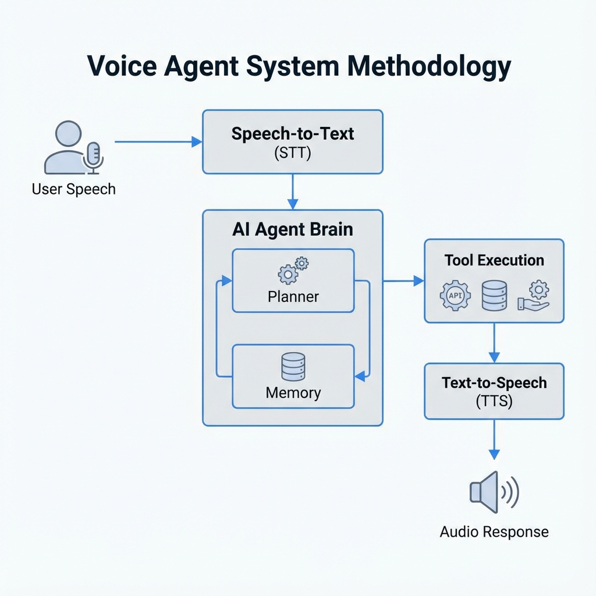
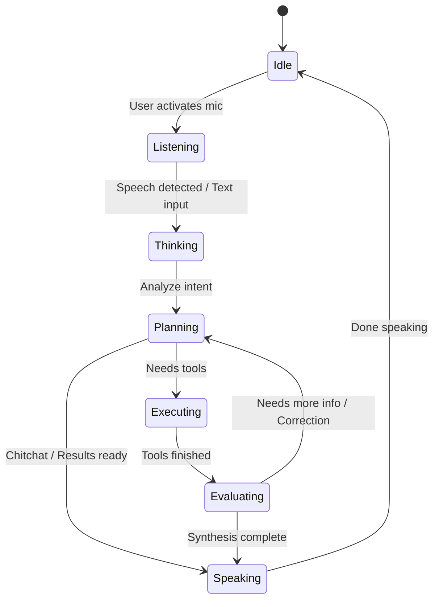
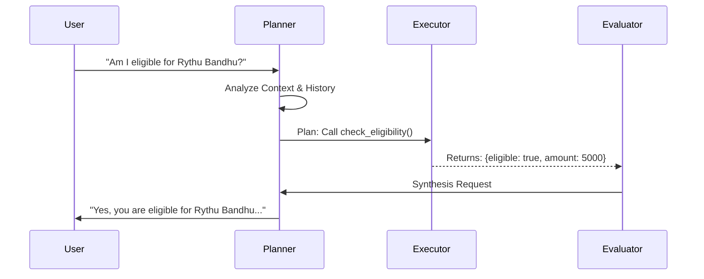
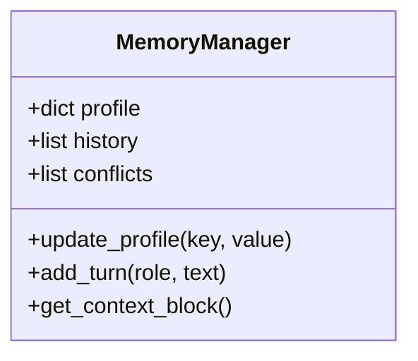

# System Architecture

This document details the internal architecture of the Voice Agent, including its lifecycle, decision-making process, memory management, and prompting capabilities.

## 1. Agent Lifecycle

The `AgentService` runs a continuous main loop that transitions between several discrete states. This ensures the agent is always in a known state (Listening, Thinking, Speaking) and handles errors gracefully.

### States
- **IDLE**: Waiting for user activation or text input.
- **LISTENING**: Capturing audio via `sounddevice` and transcribing with `faster-whisper`.
- **THINKING**: Logging transcript and preparing context.
- **PLANNING**: LLM (Groq) decides the next course of action.
- **EXECUTING**: Running Python tools (e.g., database queries, eligibility checks).
- **EVALUATING**: Reviewing tool outputs to decide if the task is complete.
- **SPEAKING**: Synthesizing audio response using `edge-tts`.

## 2. Decision Flow (The "Brain")

The `Planner` is the core decision-making component. It takes the current user input and conversation context to produce a structured JSON plan.

### Core Components
*   **Planner (`agent/planner.py`)**: Uses Llama-3 (via Groq) to classify intent and generate tool calls. Output is strict JSON.
*   **Executor (`agent/executor.py`)**: Maps tool names (e.g., `check_eligibility`) to actual Python functions.
*   **Evaluator (`agent/evaluator.py`)**: Assesses if the tool output answers the user's question or if more steps are needed.

## 3. Memory Architecture

The `MemoryManager` maintains the state of the conversation and user details across the session.

*   **Profile**: Stores extracted user details (Age, Income, Occupation) for eligibility checks.
*   **History**: Keeps a rolling window of the last 5 conversation turns to maintain context.
*   **Conflict Detection**: Simple logic to detect if a user contradicts previous statements (e.g., stating income is 50k first, then 1L later).

## 4. Prompt Engineering

The system uses a robust System Prompt to define the agent's persona and operational boundaries.

### System Prompt Strategy (`agent/planner.py`)
1.  **Persona**: "Friendly, natural Telugu-speaking Government Welfare Voice Agent."
2.  **Style Constraints**:
    *   Simple, spoken Telugu.
    *   No "Tanglish" (mixed English-Telugu) unless necessary.
    *   Warm and reassuring tone.
3.  **Tool usage**: Defined as structured functions (`check_eligibility`, `search_schemes`).
4.  **State Machine Enforcement**: logical rules for when to transitions states (e.g., "If need more info -> SPEAKING").

### Context Window
To ensure low latency and relevance, the `get_context_block()` function constructs a focused context window:
*   Current User Profile
*   Last 5 Message Exchanges
*   Any Known Conflicts
